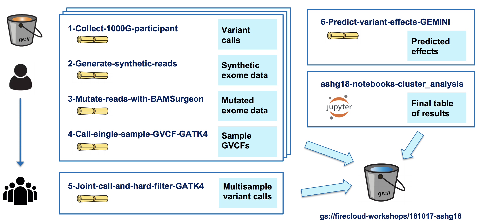
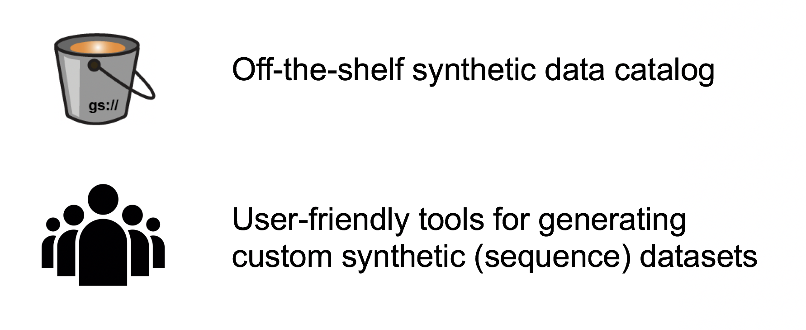

# Bringing the Power of Synthetic (Sequence) Data Generation to the Masses

This project was initiated in the context of the [FAIR Data Hackathon](https://www.bio-itworldexpo.com/fair-data-hackathon) organized by NCBI as part of the Bio-IT World conference in Boston in April 2019. If you're not familiar with [FAIR](https://www.nature.com/articles/sdata201618), it's a set of principles and protocols for making research resources more Findable, Accessible, Interoperable and Reusable. 

Our intent is to make it easier to generate synthetic sequence data for testing pipelines, sharing methods and increasing the reproducibility of published studies that involve access-restricted datasets. 

## Background

We started from a prototype our team built for ASHG (American Society of Human Genetics) 2018 as a demonstration of how to make a reproducible research study. In the original study, the authors identified risk factors for congenital heart disease using exome data from a cohort of more than 800 patients. To make this study reproducible, we needed to generate a synthetic data set, since the original data were private (we decided that it would be simpler than making the original data set sufficiently anonymous). We started from publicly available VCFs from the 1000 Genomes Project, generated synthetic exomes and spiked in mutations of interest. As part of that project, we wrote some pipelines to leverage existing tools (including NEAT and BamSurgeon) for generating synthetic data. You can find a poster that summarizes the project [here](./presentations/ASHG18-Reproducible-Paper-ToF-poster.pdf), and the Terra workspace is [here](https://app.terra.bio/#workspaces/help-gatk/Reproducibility_Case_Study_Tetralogy_of_Fallot). 

Here's an infographic that breaks down the main components of the original paper and the work that was necessary to reproduce it:

And here's an overview of the workflows and notebook we implemented:

  
----

## Objectives of this hackathon project

Creating an accurate synthetic dataset of this size for the original project was a fairly painful process, and we realized there would be great value in turning our prototype into a community resource. Hence the idea of bringing it to the FAIR Data Hackathon! 

We outlined four top objectives with tangible deliverables that would accommodate people of different backgrounds, skillsets and interests, and formed working groups to tackle them. Here's an overview of the four main buckets of work we identified:

1. [Data in demand](./Data-Demand): Search the research space to determine specifications of datasets (exomes? wgs? what coverage?) that would be most useful to generate as freely available resources so that people don't have to generate them from scratch every time. Most suitable for people with high scientific chops but low computational chops.

2. [Diversifying Options](./Diversifying-Options): Explore extending synthetic data sets to include additional variant types. Our current prototype can only spike-in SNPs, but the tools we leverage can do other variant types. Most suitable for people with analytical and/or pipeline development experience.

3. [Method optimization](./Method-Optimization): Make the workflows faster and cheaper to run. Our original prototype workflows are not very efficient in terms of either cost or runtime; if we want to build this out at scale we need the synthetic data sets to be more convenient and less costly to generate. Most suitable for people with algorithm and/or pipeline development experience.

4. [Quality control](./Quality-Control): Add quality control. Once we generate the synthetic data, we need to make sure it matches what we expect based on method parameters, that it is suitable for its intended purposes, and we need to verify that we can pull out the variants that we spiked in. Most suitable for people with analytical and/or pipeline development experience.
  
----

## Workspace in Terra

For the purposes of the hackathon, we will perform all computational work on [Terra](https://terra.bio/), an open cloud-based platform for genomic analysis operated by the Data Sciences Platform at the Broad Institute. Terra is currently in a closed beta (access on request), and will become accessible to the wider public starting May 1st 2019. 

This project is sponsored by a Google Education Grant (https://cloud.google.com/edu/). If you're joining our project, contact Tiffany Miller (tiffanym@broadinstitute.org) to get added as a contributor with write/compute permissions to the [Terra Workspace](https://app.terra.bio/#workspaces/bioit-hackathon/BioIT-Hackathon-2019-Synthetic-Data-Team). After the Hackathon, if you'd like to continue using Terra, you can sign up for individual free credits to create your own workspaces by clicking on the option on the front page or the [Terra application](https://app.terra.bio).

The shared workspace for the hackathon can be accessed publicly here:

https://app.terra.bio/#workspaces/bioit-hackathon/BioIT-Hackathon-2019-Synthetic-Data-Team

- [Instructions for Signing up for Terra during the 2019 BioIT Hackathon](Hackathon-Instructions.pdf)
- [Link to Basic Terra Introductory PDFs](https://drive.google.com/open?id=14eKJk6xYqLNm9rVnUE7FN_f6kqckZOaY)

  
----

## Hackathon project results

We summarized our results [here](results.md) on Day 2, and later presented a more polished recap and summary in the FAIR data track of the BioIT conference. Those slides are here in [PPT](./presentations/BioIT19-FAIR-hackathon-syntheticdata-report.ppt) and [PDF](./presentations/BioIT19-FAIR-hackathon-syntheticdata-report.pdf), and on slideshare [here](https://www.slideshare.net/GeraldineVanderAuwer/bio-ithackathon/GeraldineVanderAuwer/bio-ithackathon). 

----

## Next steps

We are looking to collaborate on developing this further into a proper resource that researchers can use off the shelf. This work will continue in https://github.com/terra-workflows/synthetic-seq-data; please go there if you are interested in contributing to the project. 

---- 

## Team contributors

Ernesto Andrianantoandro   
Dan Rozelle   
Jay Moore   
Rory Davidson   
Roma Kurilov   
Vrinda Pareek   

Adelaide Rhodes   
Allie Hajian   
Anton Kovalsky   
Ruchi Munshi   
Tiffany Miller   
Geraldine Van der Auwera   
