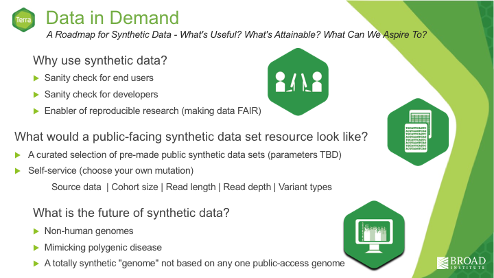

## Results produced during the NCBI FAIR hackathon 4/15-16

We summarized our results into the following slides on Day 2 of the hackathon, and later presented a more polished recap and summary in the FAIR data track of the BioIT conference. Those slides are on slideshare [here](https://www.slideshare.net/GeraldineVanderAuwer/bio-ithackathon/GeraldineVanderAuwer/bio-ithackathon). 

### Working group #1: What kind of datasets would be useful to the community?

### Working group #2: Enable generation of more data types and more variant types 

### Working group #3: Reduce cost and runtime of our workflows

### Working group #4: Evaluate whether the synthetic data we generate is suitable

